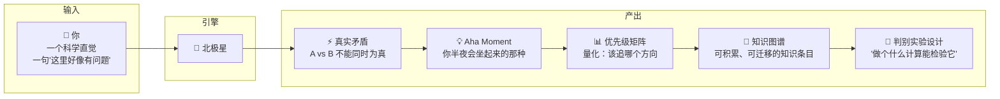
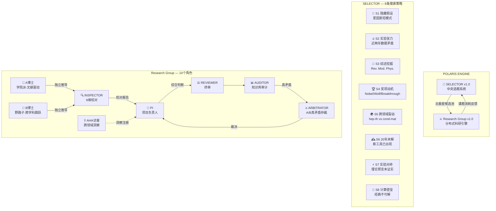
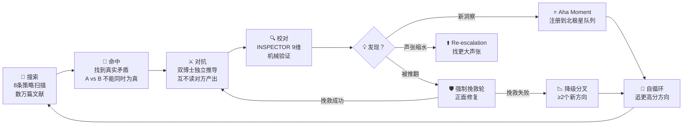
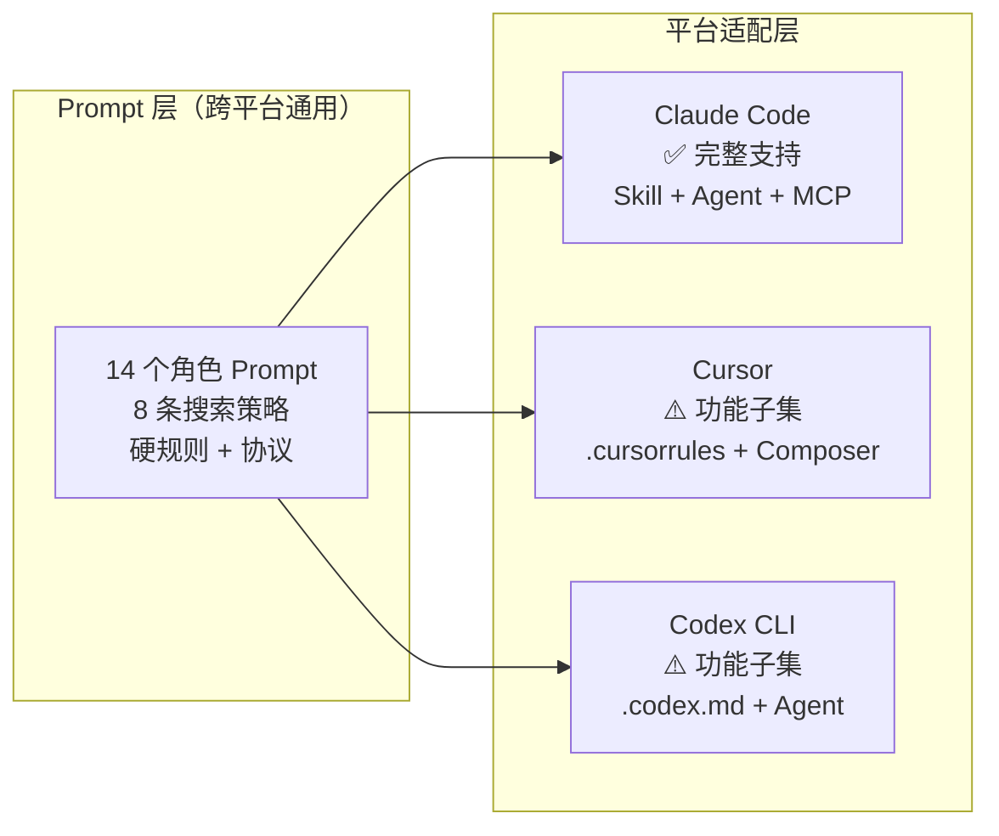
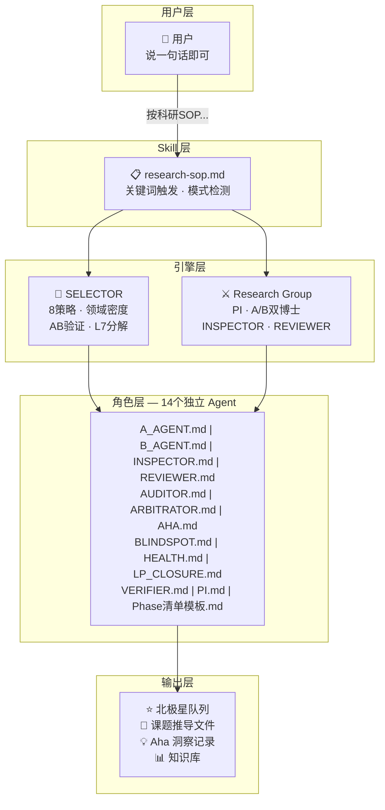
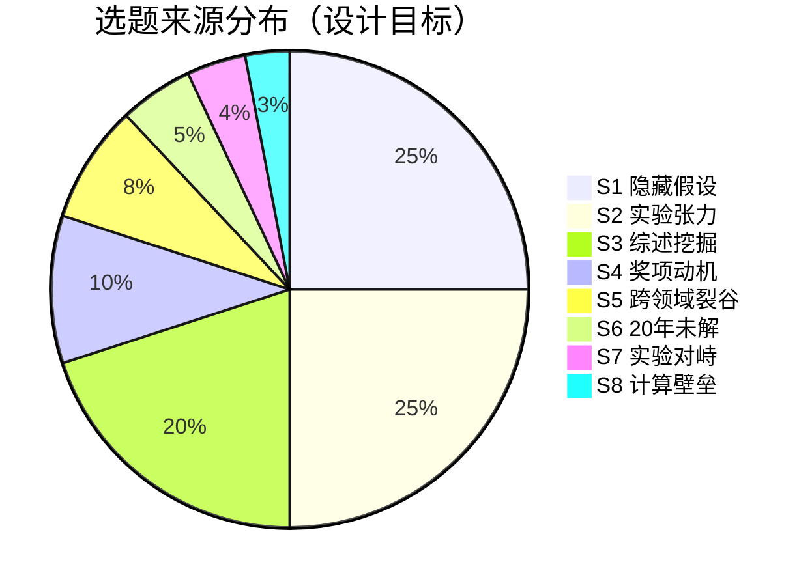
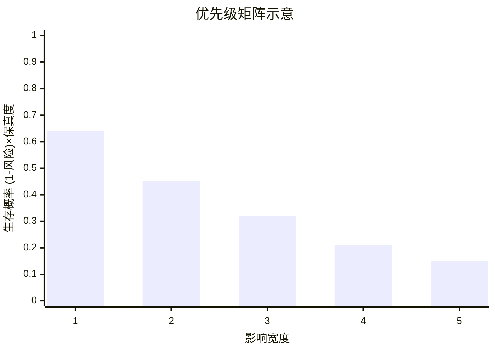
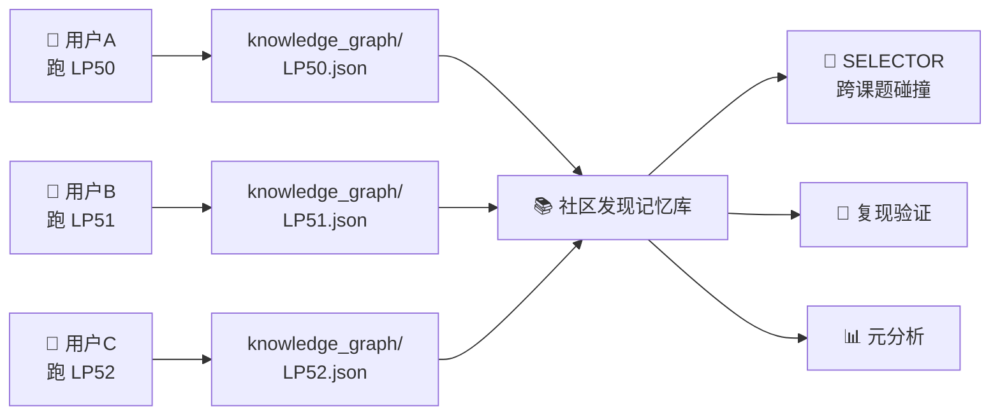
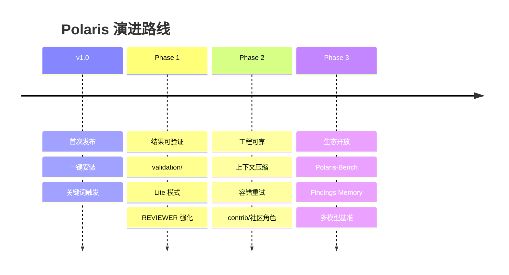

<p align="center">
  
  
  
  
</p>

<p align="center">
  
  
  
  
  
  
</p>

---

<br>

<p align="center">
  <picture>
    <source media="(prefers-color-scheme: dark)" srcset="https://readme-typing-svg.demolab.com?font=Inter&weight=700&size=40&duration=2000&pause=500&color=93C5FD&center=true&vCenter=true&width=700&lines=%E5%8C%97%E6%9E%81%E6%98%9F+%C2%B7+Polaris;%E6%AF%8F%E4%B8%80%E4%B8%AA%E4%BA%BA%E9%83%BD%E5%8F%AF%E4%BB%A5%E6%98%AF%E7%A7%91%E5%AD%A6%E5%AE%B6" />
    <source media="(prefers-color-scheme: light)" srcset="https://readme-typing-svg.demolab.com?font=Inter&weight=700&size=40&duration=2000&pause=500&color=1E3A5F&center=true&vCenter=true&width=700&lines=%E5%8C%97%E6%9E%81%E6%98%9F+%C2%B7+Polaris;%E6%AF%8F%E4%B8%80%E4%B8%AA%E4%BA%BA%E9%83%BD%E5%8F%AF%E4%BB%A5%E6%98%AF%E7%A7%91%E5%AD%A6%E5%AE%B6" />
  </picture>
</p>

<p align="center">
  <b>AI 原生科研引擎</b> · 让每一个追问星空的人，都能触碰真理的边界<br>
  <sub>不是写论文的工具。是寻找 <b>Aha Moment</b> 的引擎。<br>你的发现 = 一份标准 JSON。慢慢地，这份 JSON 替代学术论文。</sub>
</p>

<br>

---

## 为什么会有北极星？

我小时候的梦想是当科学家。

不是"想考上好大学"那种。是夜里爬到楼顶看星星的那种。是想知道**薛定谔的猫到底怎么回事**、**麦克斯韦方程组为什么那么美**、**黑洞里信息到底去哪儿了**——的那种。

后来读了文科。厚厚的《固体物理》《量子场论》摆在面前，像一堵墙。不是不想翻，是翻不动。时间、数学门槛、学术圈的壁垒——每一样都足够把一个"想理解世界"的人挡在外面。

**但你有没有想过一个问题：**

爱因斯坦 1905 年写出狭义相对论的时候，没有对撞机，没有超级计算机，甚至没有稳定的学术职位。他手里只有：两篇别人的实验论文，洛伦兹变换的骨架，和**一个所有人都默认但从来没人质疑过的前提——"同时性是绝对的"**。

质疑那个前提，不需要 PhD。需要的是**知道往哪看**。

这就是北极星想做的事：

> **推动科研进步，不是发论文。** 让每一个有科学直觉的人——无论文理——都能在 AI 的帮助下，找到那个"所有人都默认但可能错了"的前提，发起一次真正的理论突破。**你的发现永远属于你——通过 ORCID 确权，通过 JSON 发表。**

我们不写论文格式的八股。不做文献综述的体力活。
我们找的是 **矛盾**——两个基本原理不能同时为真——然后让 AI 以严格对抗的方式，寻找解释、寻找突破、寻找那个让你半夜坐起来的 **Aha Moment**。

**市面上大部分的 AI 科研工具，最大的痛点不是写作能力——是缺 Idea。** 它们能帮你排版、润色、查文献、写综述，但没人告诉你去研究什么、矛盾在哪里、哪个方向值得打。北极星试图解决的就是这件事。

<br>

---

## 🎁 你会得到什么？

**不是论文。比论文更值钱。**



### 五种产出，五种用法

| 📦 产出 | 📝 长什么样 | 🎯 怎么用 |
|---------|------------|----------|
| **真实矛盾** | "命题 A（可积系统的等谱演化）vs 命题 B（热力学第二定律），不能同时为真" | 这就是你的**研究方向**。不是泛泛的"我研究量子"，是一个具体的、可证伪的命题对 |
| **Aha Moment** | 双博士独立推导后发现的意外连接，比如"量子度规奇点与超导 Tc 存在未报告的对应关系" | 发朋友圈也行，写成 arXiv 预印本也行，作为下一个课题的起点也行。**这是你自己的发现** |
| **优先级矩阵** | 量化分数表，告诉你当前哪个方向最值得追、哪个该降级 | 科研资源有限。矩阵告诉你**时间和算力该花在哪** |
| **知识图谱** | 结构化的知识条目（K001: 可积性→等谱演化→信息不丢失 / K002: 热力学第二定律→熵产生→不可逆） | 可积累、可搜索、可跨课题碰撞。**不是一次性消费** |
| **判别实验** | "在 BEC 类比黑洞中，Rb-87 凝聚体 n₀=10¹⁴ cm⁻³，若声张成立则 Hawking 温度 = X ± Y nK" | 如果你认识做实验的人，这是可以直接递过去的。如果只有你自己，这是下一步计算任务的起点 |

### 不会得到什么

- ❌ 不是 LaTeX 排好的投稿论文（那是 PaperSpine 的事）
- ❌ 不是"这个方向不错建议研究"的模糊建议
- ❌ 不是替你读完 50 篇论文的摘要机
- ❌ 不是保证结果能发 Nature 的许愿机

**你会得到的是：一个明确的矛盾、一条被严格验证过的推理链、一个你可以指着说"这是我发现的"的 Aha Moment。**

> 🪝 **这些恰恰是市面上其他论文写作工具最缺的东西——一个真正的 Idea。** 把北极星产出的矛盾 + 推导链 + Aha Moment，接上任何一个论文写作 Skill，也许就是一篇 PRL。

<br>

---

## 🧭 北极星是什么？



<p align="center">
  <sub><b>北极星架构总览</b> — SELECTOR 发现矛盾，Research Group 驱动 14 个 AI 角色以严格对抗方式寻找突破</sub>
</p>

<br>

**北极星不是聊天机器人。** 它是一个有严格纪律的科研执行系统：

- **分布式 Adversarial Peer-Review** — 不等假说输出后再审。INSPECTOR（确定性+语义校对）、REVIEWER（恶意审稿，每 3 轮攻击一次）、ARBITRATOR（真矛盾裁决）、R1 先发拦截——四层防线嵌入流程每一步
- **双路径对抗推导** — A 博士（学院派）和 B 博士（野路子）从不同框架独立攻击同一问题，**互不读对方产出**
- **9 维校对门控** — 量纲、方向、循环论证、量级、代数验算、极限退化、声张缩水、替代解释、落地计算
- **硬规则强制** — 最低 3 轮才能收官，被推翻必须先挽救，PI 不得手写 INSPECTOR 报告
- **北极星优先级矩阵** — 量化评分，总是追最高分的那个方向

<br>

---

## 🎯 我们找的不是论文，是 Aha Moment



<p align="center">
  <sub><b>核心循环</b> — 不是线性流水线，是自我驱动的 Aha Moment 发现引擎</sub>
</p>

<br>

### 一个真实的 Aha Moment 长什么样？

```
表面矛盾："GHD 预测 vs Fache 实验数据不符"
     ↓ 深挖 1
等谱演化假设不成立？耗散打破了可积性
     ↓ 深挖 2
GHD 预设 Gibbs 平衡 → 非保守系统不满足 → 可积性是前提
     ↓ 深挖 3（基础原理层）
命题 A：可积系统的等谱演化 = 信息不丢失
命题 B：热力学第二定律 = 熵必须产生
→ 两个基本原理不能同时为真
→ ⭐ Aha Moment：可积性与热力学不可逆性的深层矛盾
```

这就是我们在找的东西。不是"这个参数调一调能发 PRB"——是**两个基本原理撞在一起，必须有一个让路**。

<br>

### 🏆 真实案例：LP24 — 从欧拉公式到统一约束方程

> 完整推导过程见 [`examples/LP24-EulerUnification/`](examples/LP24-EulerUnification/) — 44 个文件，3 轮 AB 对抗，1 次终审，1 次消融审计。

**起点：一个所有人都默认但没人质疑过的前提**

欧拉公式 e^(iθ) = cos θ + i sin θ。每个物理系学生第一天就学会它。但从来没人问过：**|e^(iθ)|² = 1 这个条件，如果当成物理约束来用，会发生什么？**

**过程：3 轮 AB 对抗，4 个机制接力生效**

```
Round 1: A博士从纤维丛出发，B博士从信息论切入
         → INSPECTOR 发现 |e^(iθ)|²=1→Schrödinger 是循环论证 ❌

Round 2: 转向"约束优先"框架，构建统一约束 ĈΨ = 0
         → A博士发现 {ħ₀^m, Ĥ₀} 不闭合 🔴 致命缺陷

Round 3: 消融分析介入 — 追问"验证工具本身对不对"
         → 发现 Poisson 括号是经典工具，不该用来验证量子约束
         → 统一可能需要范畴论自然变换，不是 Lie 代数闭合
         
         → REVIEWER 终审：16 条引用全真实 ✅ | Lusanna 先发 ⚠️
         → 4 条声张被证伪 | 4 条存活 | Ĵ 约束 = 唯一原创点
```

**哪些机制起了关键作用：**

| 机制 | 做了什么 | 没有它会怎样 |
|------|---------|------------|
| **INSPECTOR 校对** | R1 发现 |e^(iθ)|²=1→Schrödinger 是重言式 | 第一轮的错误推导会被当成"进展"继续推 |
| **A/B 双路径对抗** | A 学院派找到 {ħ₀^m, Ĥ₀} 不闭合，B 野路子发现跨学科连接 | 只用 A—漏掉跨域洞察。只用 B—漏掉数学致命缺陷 |
| **消融分析** | 追问"Poisson 括号这个工具本身对不对" | 会把工具的 artifact 当成框架的错误，错杀存活声张 |
| **REVIEWER 终审** | 逐条验证 16 条引用，发现 Lusanna 1997 先发 | "统一约束代数"声张会撞上已有文献，投稿被秒拒 |
| **Ĵ 独立抽取** | 从被部分证伪的框架中，把唯一原创点救出来 | 整个课题的遗产随框架一起被埋掉 |

**结论：有边界 — 不是胜利，是诚实**

LP24 没有产出"QM 和 GR 被统一了"的 PRL。它产出了更重要的东西：

- ❌ 4 条声张被严格证伪（包括循环论证、先发冲突、工具误用）
- ✅ Ĵ = dS_vN/dτ + ∇_μ J^μ_G = 0 — 一个原创的非平凡约束，无已知先发，生/死测试通过
- ✅ 三层约束结构（相空间/Hilbert/热力学）— 组织已知物理的新概念框架
- 📌 一个教训：统一需要范畴论自然变换，不是 Lie 代数闭合

**这不是"失败"——这是科学。** 大部分课题走到最后都是"有边界"。但如果没有这套机制，LP24 很可能变成一篇"用几何重述量子力学"的论文——数学自洽但没有物理增量。消融分析把它拦住了，Ĵ 约束把它救回来了。

> 📂 完整推导链、Phase清单、北极星队列、REVIEWER报告、消融审计 —— 见 [`examples/LP24-EulerUnification/`](examples/LP24-EulerUnification/)

<br>

---

## 📥 安装指南

### 前置条件

| 依赖 | 必须？ | 说明 |
|------|--------|------|
| **Claude Code** | ✅ 必须 | [安装指南](https://docs.anthropic.com/en/docs/claude-code) |
| **Git** | ✅ 必须 | 克隆仓库用 |
| **[paper-search-mcp](https://github.com/openags/paper-search-mcp)** | ⚠️ 强烈建议 | 学术搜索主引擎（1.7k⭐），SELECTOR 的 8 条搜索策略全部依赖它。不装自动降级到 WebSearch，但精度和效率大幅下降 |

### 第 1 步：安装北极星 Skill

```bash
# 克隆到 Claude Code 的全局 skills 目录
git clone https://github.com/val1813/polaris.git ~/.claude/skills/polaris/
```

### 第 2 步：安装 paper-search-mcp（强烈建议）

这是北极星的学术搜索引擎。8 条选题策略、A 博士的文献检索、REVIEWER 的引用核实——全都依赖它。**不装也能跑，但相当于关掉了一大半引擎。**

```bash
# 方式 A：通过 Smithery 一键安装（推荐）
npx @smithery/cli install @openags/paper-search-mcp --client claude

# 方式 B：手动配置
# 在 Claude Code 的 MCP 设置中添加，详见：
# https://github.com/openags/paper-search-mcp
```

> ⏱️ 安装 paper-search-mcp 后第一次选题可能需要 10-20 分钟（遍历 8 条策略）。不用管它，让它跑。

### 第 3 步：验证安装

在 Claude Code 中敲 `/skills` 查看技能列表，应该能看到 `research-sop`。

然后说一句 **"北极星"**——如果 Claude 开始询问"选题还是推进"，说明安装成功。

> 💰 **Token 消耗提醒：** 一个完整课题（3 轮 AB + INSPECTOR + REVIEWER）需启动 ~13 个 Agent。**无需昂贵的旗舰模型——DeepSeek V4 完全能胜任全部 SOP 流程**，从选题到收官一气呵成。不必在 token 上焦虑。

### 安装常见问题

<details>
<summary><b>Windows 下 ~/.claude/skills/ 在哪？</b></summary>

`~` = `C:\Users\你的用户名\`。完整路径：`C:\Users\你的用户名\.claude\skills\polaris\`
</details>

<details>
<summary><b>git clone 报权限错误？</b></summary>

确认仓库已设为 Public。或者在克隆前先 `git clone git@github.com:val1813/polaris.git`（SSH）。
</details>

<details>
<summary><b>安装后说"按科研SOP"没反应？</b></summary>

重启 Claude Code 试试。Skills 在启动时扫描，新安装的需要刷新。
</details>

<br>

---

## ⚡ 快速开始

> 💡 **不想折腾安装？** 点击右上角 **⏬ Code → Download ZIP**，解压后告诉 AI：
>
> **"请读目录，将此套流程记到记忆中。如果发现 vendor/paper-search-mcp.zip 未解压配置，提醒我一句命令即可配置。以后说寻找课题或者科研SOP，请按这个要求严格执行。"**
>
> 零配置直接跑（MCP 没配会自动降级 WebSearch，想配也只需一句命令）。

安装后，直接对 Claude Code 说：

| 🗣️ 你说 | 🚀 发生什么 |
|----------|------------|
| **"按科研SOP寻找课题"** | SELECTOR 启动 8 条搜索策略，扫描文献，找到真实矛盾，产出北极星候选池 |
| **"按科研SOP开展科研"** | Research Group 引擎启动，PI + A/B 双博士 + INSPECTOR + REVIEWER 全线运转 |

### 第 4 步（可选）：安装验证引擎

一行为 Python 装上物理验证工具。**全部免费，零 API Key，纯本机跑。** 不装也能用，装了 B 博士产出的公式可以扔给 `validate.py` 做确定性检查——量纲、极限退化、量级、代数恒等式，Python 不会漏。

```bash
pip install -r validation/requirements.txt
```

只需要核心（sympy+pint，几 MB）：`pip install sympy pint`

> 💡 **装的包越多，能验的命题种类越多。** 量子方向装 QuTiP，引力方向装 EinsteinPy。不研究那个方向就不用装。

### 第一次使用？

```bash
# 1. 选题 — 让 AI 找到值得攻打的方向
"按科研SOP寻找课题"

# 2. 推进 — 从候选池选一个，开始探索
"按科研SOP开展科研，初始北极星选 LP-01"

# 3. 等待 — 系统自动执行 3+ 轮 AB 对抗
#    每轮有 INSPECTOR 校对，PI 综合
#    直到收敛或被推翻

# 4. 遇到 Aha Moment → 自动注册到优先级队列
#    系统总是追最高分的那个方向
```

<br>

---

## 💬 提示词大全

> 以下提示词可以直接复制使用。Claude 会自动识别意图并启动对应流程。

### 🧭 选题相关

| 提示词 | 效果 |
|--------|------|
| `按科研SOP寻找课题` | 启动完整 SELECTOR 流程，扫描文献生成候选池 |
| `帮我找一些量子引力方向的隐藏假设` | 定向选题，指定物理领域 |
| `候选池空了，补货` | 触发 SELECTOR 补充新候选 |
| `看看最近有什么实验-理论矛盾` | 专门触发 S2 实验张力扫描 |

### ⚔️ 科研推进相关

| 提示词 | 效果 |
|--------|------|
| `按科研SOP开展科研` | 启动完整 Research Group 流程 |
| `继续推进 LP-03` | 恢复指定课题，从上次断点继续 |
| `看看当前北极星队列` | PI 展示优先级矩阵，决定下一步方向 |
| `AHA 访客来一轮` | 强制触发跨领域洞察 |

### 📋 状态管理

| 提示词 | 效果 |
|--------|------|
| `当前进度` | 查看 Phase 清单 [✅] 完成情况 |
| `检查系统健康` | 触发 HEALTH 诊断 |
| `严格检验现有成果，然后严格按SOP继续推进` | **AI 中途停了？不知道到哪了？说这句就行** |
| `收官 LP-02` | 对指定课题执行完整收官流程 |
| `知识库汇总` | 查看所有已完成课题的知识条目 |

<br>

---

## 🎬 示例对话

<details>
<summary><b>完整示例：从选题到第一个 Aha Moment</b></summary>

```
👤 用户：按科研SOP寻找课题

🤖 Claude：收到。启动 SELECTOR v1.0。
         → S1 隐藏假设挖掘... 命中 1 个候选
         → S2 实验张力扫描... 命中 2 个候选
         → S3 综述挖掘... 命中 3 个开放问题
         → 领域密度扫描...
         → AB 验证...
         → 候选池已写入 shared/北极星候选池.md
         
         📊 本次产出：
         LP-07: 量子几何相位与超导电性 [S1] 分数: 3.2
         LP-08: muon g-2 与格点 QCD 张力 [S2] 分数: 2.8
         LP-09: 量子疤痕与 ETH [S3] 分数: 2.4

👤 用户：按科研SOP开展科研，做 LP-07

🤖 Claude：好的。初始化 LP-07 项目目录。
         → 复制 Phase清单模板 → 创建北极星队列
         → 启动第 1 轮 AB 探索
         
         🔵 A博士（学院派）：从拓扑能带理论出发...
         🟠 B博士（野路子）：从信息论角度看量子几何...
         
         → INSPECTOR 校对：✅ 量纲通过，⚠️ 声张缩水警告
         → PI 综合：A/B 框架不同但指向同一方向
         
         ...（第 2 轮）...
         ...（第 3 轮）...
         
         💡 Aha Moment！B 博士第 3 轮发现：
         量子度规的奇点与超导转变温度存在未报告的对应关系
         → 注册到北极星队列，分数 4.1 > 当前 3.2
         → 🔄 自动切换到新方向
```
</details>

<br>

<br>

---

## 🖥️ 平台兼容性

北极星的核心是 **Prompt 集合 + 方法论协议**——这是一套纯文本的科研执行规范，不绑定任何特定 AI 工具。不同平台的差异在于*如何加载这些 Prompt* 和*搜索能力*。



### 功能兼容矩阵

| 能力 | Claude Code | Cursor | Codex CLI |
|------|:-----------:|:------:|:---------:|
| **关键词触发 Skill** | ✅ 原生 | ❌ 无 Skill 系统 | ❌ 无 Skill 系统 |
| **Agent 子代理** | ✅ Agent 工具 | ⚠️ Composer Agent（手动拆分） | ⚠️ 手动拆分窗口 |
| **paper-search-mcp** | ✅ MCP 协议 | ❌ 无 MCP → WebSearch 降级 | ❌ 无 MCP → WebSearch 降级 |
| **14 个角色独立运行** | ✅ 自动 | ⚠️ 手动加载 prompt | ⚠️ 手动加载 prompt |
| **硬规则强制执行** | ✅ | ✅ prompt 自带规则 | ✅ prompt 自带规则 |
| **Phase 清单追踪** | ✅ | ✅ 纯文件操作 | ✅ 纯文件操作 |

### 在 Cursor 中使用

Cursor 没有 Skill 系统和 MCP，但**所有 Prompt 仍然是有效的**——你只需要手动加载它们。

**第 1 步：配置项目规则**

将以下内容添加到项目的 `.cursorrules`（或 `.cursor/rules/`）：

```bash
# 复制核心规则文件到项目
cp research-group/CLAUDE.md .cursorrules
```

**第 2 步：启动科研流程**

在 Cursor 的 Composer（Agent 模式）中，手动输入启动 prompt：

```
你是 PI（项目负责人），按照以下流程执行科研：

1. 读 research-group/CLAUDE.md → 了解角色分工和执行流程
2. 如果是要选题 → 读 topic-selector/SELECTOR.md → 执行 S1~S8 搜索
3. 如果是要科研 → 创建 Phase清单.md → 启动 A/B 博士探索

注意：搜索工具只能用 WebSearch（Cursor 不支持 paper-search-mcp），
      但搜索策略和自过滤标准不变。

现在开始：按科研SOP寻找课题（或：按科研SOP开展科研）
```

**第 3 步：手动拆分 Agent**

Cursor 没有 Agent 工具。替代方案：
- **A 博士**：开一个新 Composer 窗口，粘贴 `research-group/A_AGENT.md` 的 prompt + 当前任务
- **B 博士**：开另一个 Composer 窗口，粘贴 `research-group/B_AGENT.md` 的 prompt + 当前任务
- **INSPECTOR**：等两者完成后，用新窗口粘贴 `research-group/INSPECTOR.md` + 推导文件

### 在 Codex CLI 中使用

Codex（OpenAI Codex CLI）的配置机制与 Claude Code 类似。

**第 1 步：配置项目指令**

将核心规则写入 Codex 的项目配置文件：

```bash
# Codex 读取项目根目录的指令文件
cp research-group/CLAUDE.md .codex.md
# 或在 codex.yaml 中指定 instructions 文件
```

**第 2 步：手动触发**

Codex 没有 Skill 触发机制，需要显式输入指令。推荐在对话开头直接贴：

```
Read research-group/CLAUDE.md and follow the full research SOP.
I want to: [寻找课题 / 开展科研 / 继续推进 LP-XX]
Use WebSearch for all academic search (paper-search-mcp not available on Codex).
```

**第 3 步：Agent 拆分**

与 Cursor 类似——每个角色开独立 Codex 会话，粘贴对应 prompt。

### 跨平台通用提示词模板

> 以下模板不依赖任何平台特有功能，复制到任何 AI 编程工具即可启动。

<details>
<summary><b>通用启动模板（复制即用）</b></summary>

```
## 角色：PI（科研项目负责人）

你是一套严格科研执行系统的 PI。你的任务不是自己推导，而是按照
北极星·Polaris 科研 SOP 协调多个 AI 角色完成研究。

### 第一步：读入系统文件
1. 读 research-group/CLAUDE.md — 了解完整 SOP
2. 读 research-group/PI.md — 了解 PI 操作手册（优先级矩阵/降级/挽救/深挖）

### 第二步：判断模式
- 选题模式：读 topic-selector/SELECTOR.md → 执行 8 条搜索策略
- 科研模式：创建 Phase清单.md → 启动 AB 探索循环

### 第三步：执行
按 Phase清单.md 的 [ ] 逐行执行，每完成一步勾 [✅]。
最低 3 轮才能收官。INSPECTOR 必须独立运行（不能由 PI 自己写）。

### 搜索工具说明
- 有 paper-search-mcp → 优先使用（学术搜索专用）
- 无 MCP → 用 WebSearch，但遵守相同的搜索策略和自过滤标准
- 每次搜索后标注使用的工具

### 硬规则（不可违反）
1. 每步必须勾 [✅]
2. 最低 3 轮
3. A/B 互不读对方产出
4. PI 不得手写 INSPECTOR 报告
5. 学术搜索必须先用 paper-search-mcp（如不可用则标注降级）

开始执行：[按科研SOP寻找课题 / 按科研SOP开展科研]
```
</details>

<br>



<br>

### 14 个角色 · 完整分工

| 🎭 角色 | 📋 职责 | ⏰ 触发时机 |
|---------|--------|-----------|
| **PI** | 项目负责人 — 设边界、保方向、做综合 | 持续运行 |
| **A 博士** | 学院派 — 文献驱动，站在巨人肩膀上 | 每轮探索 |
| **B 博士** | 野路子 — 跨学科跳跃，终极产出=改变北极星 | 每轮探索 |
| **INSPECTOR** | 校对 — 量纲/方向/循环/量级/代数/极限/声张/替代解释/落地 | A/B 每轮完成后 |
| **REVIEWER** | 终审 — 查重 + 五条拒稿标准 | 收官时 |
| **AUDITOR** | 审计 — 知识库完整性 + A/B 张力检测 | 收官时 |
| **ARBITRATOR** | 仲裁 — 判断 A/B 矛盾是真实物理矛盾还是术语差异 | AUDITOR 发现致命张力 |
| **AHA 访客** | 洞察 — 跨领域类比，产生突破性连接 | 连续 5 轮无 AHA 等 |
| **BLINDSPOT** | 盲点 — 系统性检测思维盲区 | 定期 |
| **HEALTH** | 健康 — 系统状态诊断 | 定期 |
| **LP_CLOSURE** | 收官 — 长命题最终报告 | 长命题完成时 |
| **VERIFIER** | 验算 — 代数验算 + 极限退化 | 合并入 INSPECTOR Q5 |

<br>

---

## 🔬 8 条搜索策略 · 找到值得攻打的方向



| 优先级 | 代号 | 策略 | 搜索什么 | 灵感来源 |
|--------|------|------|---------|---------|
| 🔮 最高 | **S1** | 隐藏假设挖掘 | 所有人都默认但从未检验的前提 | 爱因斯坦 1905 |
| 🔥 高 | **S2** | 实验张力扫描 | 近两年实验数据与理论的 ≥3σ 矛盾 | 迈克耳孙-莫雷 |
| 📖 高 | **S3** | 综述开放问题 | Rev. Mod. Phys. 等顶刊综述的 "open problem" | 学术共识 |
| 🏆 高 | **S4** | 奖项动机分析 | Nobel / Wolf / Breakthrough 奖后的遗留问题 | 获奖者指的路 |
| 🌍 兜底 | **S5** | 跨领域共识裂谷 | hep-th 和 cond-mat 对同一问题的相反结论 | 两群聪明人各说各的 |
| 🕰️ 兜底 | **S6** | 20 年未解问题 | 长期搁置但近 5 年新工具已出现的老问题 | 时机到了 |
| ⚡ 兜底 | **S7** | 实验-理论对峙 | ≥2 独立实验组确认的异常 / 理论明确预言但无人验证 | 实验在说话 |
| 🔐 兜底 | **S8** | 计算复杂性壁垒 | 经典计算不可能但子问题可分解 | 绕开指数墙 |

**每条策略都有独立的文献搜索指令、自过滤标准、领域密度扫描和 AB 双博士验证。** 不靠运气，靠穷举。

<br>

---

## 📊 北极星优先级矩阵

不是拍脑袋选方向。每个候选都经过量化评分：

```
分数 = 影响宽度 × (1 - 自毁风险) × 完成度奖励 × 声张保真度

影响宽度：  基础原理 = 5  方法论 = 3  单系统 = 1
自毁风险：  低 = 0.2    中 = 0.5   高 = 0.8
完成度奖励：0% = 1.0   30% = 1.3  70% = 1.5（封顶）
声张保真度：1.0 = 同级  0.7 = 收窄  0.4 = 降级为经验关联
```



- **自动切换：** 新候选分数 > 当前 ×1.3 → 允许切换
- **70% 保护：** 完成度 ≥70% → 切换门槛升至 ×1.5
- **被推翻 ≠ 立刻降级：** 先强制 1 轮正面挽救，挽救失败才降级并强制分叉 ≥2 个新方向

<br>

---

## 📁 项目结构

```
polaris/
  ├── README.md                   ← 本文件
  ├── research-sop.md             ← Skill 入口（关键词触发 + 模式检测）
  │
  ├── research-group/             ← 14 个角色的 Prompt + 协议
  │   ├── PI.md                   ← 操作手册（矩阵/降级/挽救/深挖）
  │   ├── Phase清单模板.md         ← 执行清单
  │   ├── A_AGENT.md              ← A 博士（学院派）
  │   ├── B_AGENT.md              ← B 博士（野路子）
  │   ├── INSPECTOR.md            ← 校对 Agent（9 维）
  │   ├── REVIEWER.md             ← 终审 Agent
  │   ├── AUDITOR.md              ← 知识库审计
  │   ├── ARBITRATOR.md           ← A/B 真矛盾仲裁
  │   ├── AHA.md                  ← 跨领域洞察
  │   ├── BLINDSPOT.md            ← 盲点检测
  │   ├── HEALTH.md               ← 系统健康
  │   ├── LP_CLOSURE.md           ← 课题收官
  │   └── VERIFIER.md             ← 验算（已并入 INSPECTOR）
  │
  ├── platforms/                   ← 多平台适配
  │   ├── cursor/
  │   │   └── .cursorrules        ← Cursor 项目规则（复制到项目根目录）
  │   └── codex/
  │       └── .codex.md           ← Codex CLI 项目指令（复制到项目根目录）
  │
  ├── vendor/                     ← 内置依赖
  │   └── paper-search-mcp.zip   ← 学术搜索 MCP 安装包（开箱即用）
  │
  ├── validation/                 ← 验证闭环（Phase 1）
  │   └── README.md              ← 验证协议：推导可复现·文献锚点·可检验预测
  ├── experiments/                ← A/B 测试框架（Phase 2）
  │   └── README.md              ← Prompt 对比实验模板
  ├── contrib/                    ← 社区角色（Phase 2）
  │   ├── AGENTS.md              ← 贡献模型：三层架构
  │   └── README.md              ← 领域 Agent 贡献模板
  ├── knowledge_graph/            ← 发现记忆库
  │   └── README.md              ← 条目格式 + 社区提交指南
  ├── benchmarks/                 ← 基准测试集（Phase 3）
  │   ├── README.md              ← 评分标准 + 使用方式
  │   ├── score.py               ← 固定基准评分
  │   ├── metrics.py             ← 结构质量评分（领域无关）
  │   ├── generate.py            ← AI 自动生成新基准
  │   └── B0*_*.json             ← 已知矛盾条目
  ├── examples/                   ← 成果展示（社区跑过的课题）
  │   └── README.md              ← 提交格式说明
  │
  └── topic-selector/             ← 中央选题系统
      ├── SELECTOR.md             ← 8 策略 + 领域密度 + AB 验证 + L7 分解
      └── README.md
```

<br>

---

## 🚶 新手路线

**你不需要会写代码。你只需要有"这里好像有问题"的直觉。**

```
第0天：注册 ORCID iD（orcid.org，免费，3分钟）+ GitHub 账号
第1天：装好 → 启动时告诉AI你的 ORCID → 说"按科研SOP寻找课题"
第2天：从候选池选一个 → "按科研SOP开展科研" → 等 1-3 小时 → 跑完
第3天：收官时 AI 会把你的 ORCID 写入 JSON → 提 PR → 成为贡献者
```

**就三步。** 注册身份 → 跑课题 → 交 JSON。SOP 引擎在后台自动运转，收官时自动填好你的学术指纹。

> 🏛️ JSON 提交到独立仓库 **[polaris-registry](https://github.com/val1813/polaris-registry)**（待建）→ PR → 自动校验 → 合入 → 你的发现成为人类知识网络的一个节点。详见 [REGISTRY.md](REGISTRY.md)。

> 📖 详细安装 → [安装指南](#-安装指南) | 提示词速查 → [提示词大全](#-提示词大全) | 身份注册 → [ORCID.org](https://orcid.org)（免费，永久）

---

## 🤝 贡献 — 不是贡献代码，是贡献发现

**这个项目的未来不是"更完美的 SOP"。是很多很多人各自跑出发现，把 knowledge_graph JSON 交回来——每一份都用 ORCID 确权。**

你的发现永远属于你。ORCID iD 是你的学术指纹——就像 DOI 标识论文，ORCID 标识你。JSON 里同时有你的 ORCID 和你引用的 DOI，和传统论文一样——甚至更好：DOI 可能烂掉，ORCID 终身不变。

**注册身份（5 分钟，做一次）：**
1. [orcid.org](https://orcid.org) → 免费注册 → 拿到 `0000-0002-XXXX-XXXX` 格式的 ID
2. [github.com](https://github.com) → 注册账号 → 用来提 PR
3. 启动 Polaris 时告诉 AI：`"我的 ORCID 是 0000-0002-XXXX-XXXX，GitHub 是 xxx"`

每一份 JSON 是一个课题的遗产：核心矛盾、推导链、存活的声张、被证伪的声张、教训。格式标准化（见 `validation/schema.md`），机器可读、可搜索、可碰撞。



**愿景：** 慢慢地，这份 JSON 格式足够严谨、足够完整，以至于——它可以替代学术论文。不需要 LaTeX，不需要"Dear Editor"——一份标准化的 knowledge_graph JSON，包含矛盾、推导链、验证数据、可检验预言。机器的原生语言，人类的可读格式。

### 五种贡献方式

| 你是什么角色 | 贡献什么 | 花多久 | 合入标准 |
|------------|---------|--------|---------|
| 🧪 **跑课题的人** | `knowledge_graph/` JSON | 跑完课题顺手交 | 格式完整 + ≥1 个 confidence≥0.7 的节点 + 引用真实 |
| 🔬 **领域专家** | `contrib/` 领域 Agent 角色 | 写一个 md | 定位清晰 + 附使用案例 + 不与现有重复 |
| 📐 **熟悉某领域** | `benchmarks/` 基准条目 | 写一个 JSON | 矛盾真实 + 答案已知 + 非开放问题 |
| 🛠️ **深度用户** | `research-group/` SOP 改进 | 附对比数据 | benchmarks 通过 + metrics≥70% + ≥2 课题对比 |
| 💬 **所有人** | GitHub Issue | 1 分钟 | 描述清楚卡点 + 附截图 |

> 📋 完整审查清单 → [CONTRIBUTING.md](CONTRIBUTING.md)

### 🆘 已知问题

| # | 问题 | 需要的帮助 |
|---|------|-----------|
| **1** | 物理意义空洞化——推导在数学上自洽但落不到物理量 | 物理直觉强的人，设计"物理意义落地检查" |
| **2** | Token 消耗高 | 懂 prompt 工程的人，优化上下文压缩 |
| **3** | 检验阶段 AI 放水 | 懂代码验证的人，把更多检查做成确定性脚本 |
| **4** | 声张持续缩水——PRL 变四区 | 发过 PRL 的人，设计早期预警信号 |
| **5** | **需要更多跑课题的人——社区里 knowledge_graph JSON 越多，碰撞越有价值** | **你** |

> 🎯 凝聚态 PhD / 形式化验证 / prompt 优化 / 发过 PRL / 审过 PRL —— 你的经验对这个系统是无价的。

<br>

---

## 🗺️ 路线图



> 📋 完整分期计划、具体任务、贡献方式 → **[ROADMAP.md](ROADMAP.md)**

<br>

---

## ❓ FAQ

<details>
<summary><b>北极星和 PaperSpine 有什么区别？</b></summary>

PaperSpine 是论文写作工具（从材料到成稿）。北极星是科研发现工具（从选题到 Aha Moment）。

两者互补：北极星找到矛盾、推出结论 → PaperSpine 写成论文。
</details>

<details>
<summary><b>必须是物理学背景才能用吗？</b></summary>

不需要。这个项目的诞生，就是因为一个文科生想理解量子力学。

系统会处理文献搜索、量纲校对、代数验算。你提供的是**方向感和科学直觉**——那个"这里好像有问题"的嗅觉。
</details>

<details>
<summary><b>必须有 paper-search-mcp 吗？</b></summary>

不必须但**强烈建议**。没有它会降级到 WebSearch，搜索精度和效率显著下降。

安装：`npx @smithery/cli install @openags/paper-search-mcp --client claude`

详见 [openags/paper-search-mcp](https://github.com/openags/paper-search-mcp)（1.7k⭐）
</details>

<details>
<summary><b>系统怎么保证不是在"幻觉科研"？</b></summary>

四道防线：
1. **INSPECTOR 9 维校对** — 量纲、代数、极限退化是纯机械验证，不靠 AI 判断
2. **REVIEWER 引用核实** — 每条文献必须用 paper-search-mcp 独立验证存在性
3. **A/B 双路径对抗** — 两个完全不同的框架独立推导同一问题
4. **任何负面指控 → PI 必须独立 WebSearch 验证**
</details>

<details>
<summary><b>AI 中途停了，我不知道该判断什么，怎么办？</b></summary>

直接说这句话：

> **"请严格检验现有成果，然后严格按 SOP 继续推进"**

这句话会触发 INSPECTOR 重新校对已有推导，PI 重新评估 Phase清单状态，然后从断点继续。不需要你自己判断进度——系统会自动找到该从哪一步继续。
</details>

<details>
<summary><b>Token 消耗大吗？用什么模型跑？</b></summary>

一个完整课题（3轮）约 13 个 Agent。**DeepSeek V4 完全胜任**全部 SOP 流程，不需要昂贵的旗舰模型。
</details>

<details>
<summary><b>怎么知道系统在正常工作？</b></summary>

检查 `Phase清单.md` 的 `[✅]` 进度。如果 INSPECTOR 报告是独立 Agent 输出的（不是 PI 手写），系统就在正常工作。
</details>

<br>

---

<p align="center">
  <sub>Built with 🌌 by someone who looked up at the stars and never stopped asking why.</sub>
</p>

<p align="center">
  <sub>「重要的不是答案，而是知道问什么问题。」—— 某个抬头看星星的人</sub>
</p>
